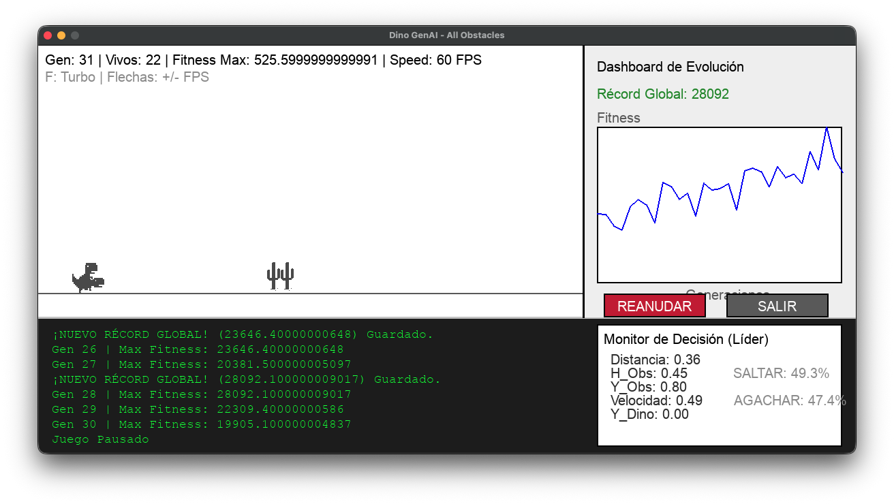
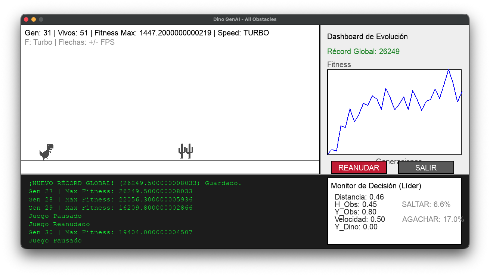
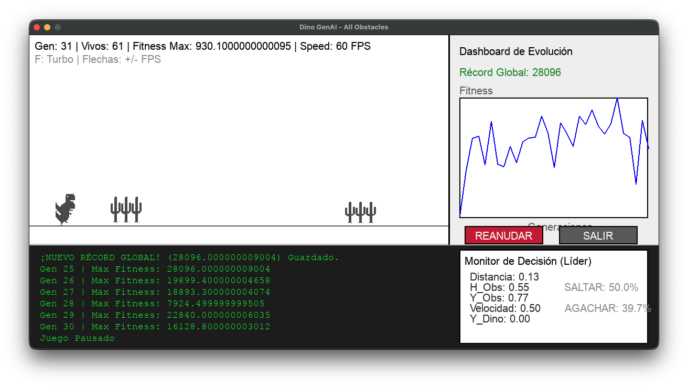
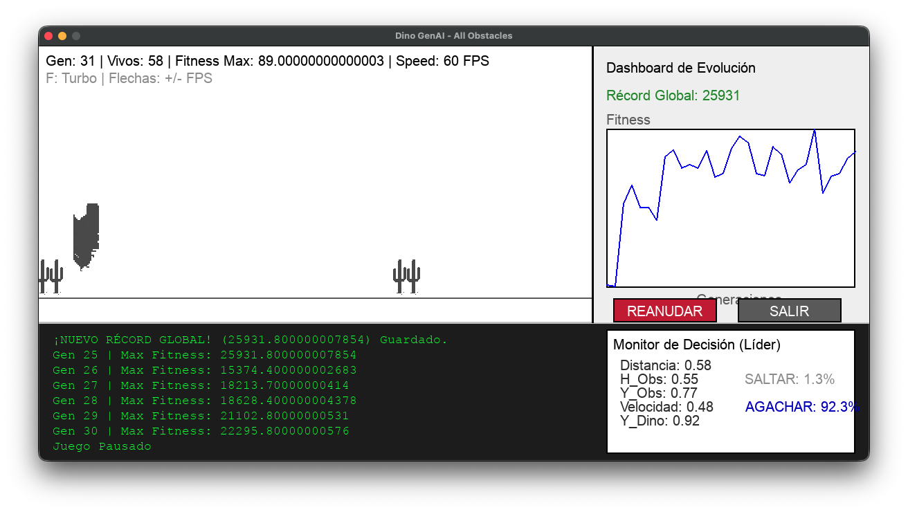

# Dino-GenAI: Agente Evolutivo para el "Dino" de Chrome

## Descripción del proyecto
Este proyecto implementa un agente inteligente funcional que toma decisiones reales a partir de un estado, utilizando técnicas de Inteligencia Artificial (**Redes Neuronales + Algoritmos Genéticos**) para jugar un clon del "Dino" de Chrome desarrollado en Pygame. El sistema incluye una arquitectura de aprendizaje por refuerzo evolutivo, persistencia de modelos y un dashboard analítico en tiempo real.

### 1. Definición del estado (S)
El estado del sistema se representa como un vector de variables numéricas que capturan la situación actual del entorno:

$$ S = \{d, a, y_{obs}, v, y\} $$

Donde las variables son:
- **$d$**: Distancia horizontal al próximo obstáculo (normalizada).
- **$a$**: Altura (dimensiones) del obstáculo.
- **$y_{obs}$**: Posición vertical del obstáculo (crucial para diferenciar pájaros de cactus).
- **$v$**: Velocidad actual del juego.
- **$y$**: Posición vertical actual del dinosaurio.

### 2. Acciones del agente (A)
El agente posee un espacio de acciones discreto mapeado a las salidas de la red neuronal:

$$ A(s) = \{a_1, a_2, a_3\} $$

- **$a_1$ (Saltar)**: El dinosaurio aplica una fuerza ascendente.
- **$a_2$ (Agacharse)**: El dinosaurio reduce su altura a la mitad para esquivar obstáculos aéreos.
- **$a_3$ (Correr)**: Estado por defecto del agente.

### 3. El Cerebro (Red Neuronal)
Utilizamos un **Perceptrón Multicapa (MLP)** implementado únicamente con NumPy para mayor eficiencia.
- **Entrada**: 5 neuronas (Estado $S$).
- **Capa Oculta**: 16 neuronas con activación **ReLU**.
- **Salida**: 2 neuronas con activación **Sigmoide** (Probabilidad de Saltar y Probabilidad de Agacharse).

### 4. Algoritmo Genético
La optimización de los pesos se realiza mediante evolución:
- **Selección**: Elitismo (preservación del mejor 10%).
- **Cruzamiento**: Intercambio de genes (pesos) entre los mejores individuos.
- **Mutación**: Variaciones aleatorias para explorar nuevas soluciones.

---

## Características Implementadas

- **Entorno Completo**: Incluye cactus de diferentes tamaños y pájaros a distintas alturas, con físicas realistas y penalización por tiempo en el aire para promover la eficiencia.
- **Dashboard Analítico**: Gráfica de rendimiento en tiempo real y un **Monitor Neuronal** que muestra los sensores y decisiones del líder.
- **Persistencia (Model Saving)**: El mejor modelo se guarda automáticamente en `data/best_model.npz`.
- **Controles de Simulación**:
  - **F**: Activa el modo **TURBO** (máxima velocidad de entrenamiento, ejecuta múltiples cálculos por frame visual).
  - **Flechas Arriba/Abajo**: Ajustan los FPS manualmente.
  - **Botones PAUSAR/REANUDAR y SALIR**: Controles interactivos en la interfaz gráfica.

---

## Estructura del Proyecto

```text
Dino-GenAI/
├── assets/          # Sprites y sonidos (PNGs generados)
├── data/            # Modelos guardados (.npz)
├── results/         # Resultados de validación (CSV)
├── src/             # Código fuente
│   ├── game.py              # Motor físico y lógica del juego
│   ├── neural_network.py    # Implementación de la Red Neuronal
│   ├── genetic_algorithm.py # Lógica de evolución y selección
│   ├── main.py              # Controlador principal y Dashboard
│   └── validator.py         # Script de pruebas de generalización
├── requirements.txt # Dependencias del proyecto (pygame, numpy)
└── README.md        # Documentación (este archivo)
```

---

## Instalación y Ejecución

1. **Clonar el repositorio e instalar dependencias**:
   ```bash
   pip install -r requirements.txt
   ```

2. **Ejecutar la simulación**:
   Desde la raíz del proyecto, ejecuta:
   ```bash
   python src/main.py
   ```

3. **Carga de Modelos**:
   Al iniciar `main.py`, el sistema listará todos los modelos `.npz` guardados en la carpeta `data/`. 
   - Ingresa el número correspondiente a un modelo de la lista para cargarlo y continuar su evolución.
   - Ingresa `0` para empezar desde cero con pesos aleatorios.

4. **Validación de Generalización (Stress Testing)**:
   Para poner a prueba la inteligencia del agente en escenarios no vistos durante el entrenamiento, ejecuta:
   ```bash
   python src/validator.py
   ```
   Este script permite elegir un modelo guardado y someterlo a pruebas de velocidad extrema, gravedad alterada o lluvia de obstáculos. Incluye un modo **Automático** que genera un análisis estadístico en `results/validation_results.csv`.

---

## Ejemplo de Ejecución
Al iniciar verás una población de 100 dinosaurios. En las primeras generaciones chocarán rápidamente. Sin embargo, gracias al algoritmo genético, tras 10-15 generaciones observarás dinosaurios capaces de esquivar grupos de cactus y reaccionar correctamente a los pájaros (agachándose o saltando según la altura).

La gráfica de la derecha (**Dashboard**) mostrará cómo el Fitness (puntuación) sube exponencialmente a medida que la población "aprende" las físicas del juego.







